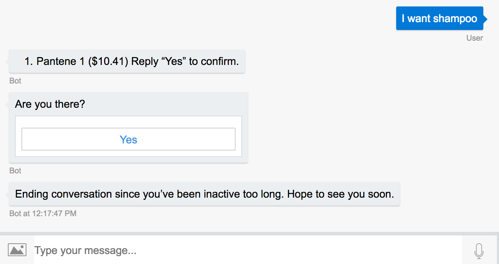

# botbuilder-timeout

[](https://github.com/user1m/botbuilder-timeout/)

[](https://david-dm.org/user1m/botbuilder-timeout)
[](https://david-dm.org/user1m/botbuilder-timeout?type=dev)
[](https://github.com/user1m/botbuilder-timeout/graphs/commit-activity)  

> © 2017, Claudius Mbemba ([@user1m](https://github.com/user1m)). MIT License.

Module for Microsoft Bot Framework to enable your bot to prompt the user if the bot detects inactivity and ultimately end the conversation if no user activity after a defined period of time.

Example:



## Installation

```shell
npm install botbuilder-timeout --save-dev
```

**Tested on Node.js v8 or newer**


## Usage

```js
const timeout = require("botbuilder-timeout");

const connector = new builder.ChatConnector({...});

const options = {
    PROMPT_IF_USER_IS_ACTIVE_MSG: "Hey are you there?",
    PROMPT_IF_USER_IS_ACTIVE_BUTTON_TEXT: "Yes I am",
    PROMPT_IF_USER_IS_ACTIVE_TIMEOUT_IN_MS: 15000,
    END_CONVERSATION_MSG: "Conversation Ended",
    END_CONVERSATION_TIMEOUT_IN_MS: 10000
};

const bot = new builder.UniversalBot(connector);

timeout.setConversationTimeout(bot, options);

```

### Options


| Option   | Description |
| -------- | ----------- |
| <h4>**`PROMPT_IF_USER_IS_ACTIVE_MSG`**</h4> `String` | Default: `'Are you there?'`. Message presented to user to confirm activity.
| <h4>**`PROMPT_IF_USER_IS_ACTIVE_BUTTON_TEXT`**</h4> `String` | Default: `'Yes'`. Button text presented during prompt checking for activity.
| <h4>**`PROMPT_IF_USER_IS_ACTIVE_TIMEOUT_IN_MS`**</h4> `Number` | Default: `30000`. Time in `milliseconds` before prompt with `PROMPT_IF_USER_IS_ACTIVE_MSG` message is presented.
| <h4>**`END_CONVERSATION_MSG`**</h4> `String` | Default: `"Ending conversation since you've been inactive too long. Hope to see you soon."` Message sent to user when conversation is ended.
| <h4>**`END_CONVERSATION_TIMEOUT_IN_MS`**</h4> `Number` | Default: `15000`. Time in `milliseconds` before conversation is ended with `END_CONVERSATION_MSG` message. |

### Full Example with Botbuilder (Node.js/Typescript)

```js
import express = require('express');
import * as builder from 'botbuilder';
import { setConversationTimeout } from "botbuilder-timeout";

console.log(`BOT ID: ${process.env.MICROSOFT_APP_ID}\nBOT PASS: ${process.env.MICROSOFT_APP_PASSWORD}`);

// Create bot and add dialogs
const server = express();
const port = process.env.port || process.env.PORT || 3978;
const connector = new builder.ChatConnector({
    appId: process.env.MICROSOFT_APP_ID,
    appPassword: process.env.MICROSOFT_APP_PASSWORD
});

const bot = new builder.UniversalBot(connector);

bot.dialog('/', [
    (session, args, next) => {
        builder.Prompts.text(session, `What's your name?`);
    },
    (session, args, next) => {
        session.send(`Hi ${session.message.text}`);
    }]
);

const options = {
    PROMPT_IF_USER_IS_ACTIVE_MSG: "Hey are you there?",
    PROMPT_IF_USER_IS_ACTIVE_TIMEOUT_IN_MS: 15000,
    END_CONVERSATION_MSG: "Conversation Ended",
    END_CONVERSATION_TIMEOUT_IN_MS: 10000
};

setConversationTimeout(bot, options);

server.post('/api/messages', connector.listen());
server.listen(port, () => {
    console.info(`Server Up: Listening at port ${port}`);
});
```

## Change-Log

See [CHANGELOG.md](https://github.com/user1m/botbuilder-timeout/blob/master/CHANGELOG.md).

## License

See [MIT](https://github.com/user1m/botbuilder-timeout/blob/master/LICENSE).
